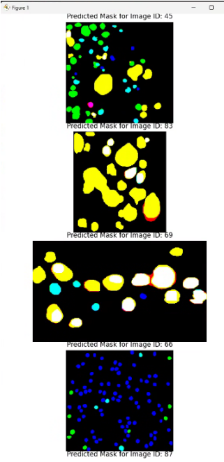
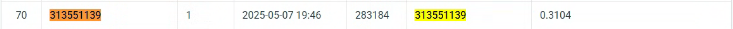
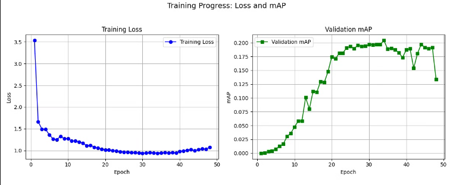

# NYCU-Computer-Vision-2025-Spring-HW3
Student ID: 313551139 

Name: 陳冠豪
## Introduction
In this report, I talk about my approach to tackling the instance segmentation task for detecting and classifying four types of cells in medical images. Instance segmentation is a more advanced computer vision task—it involves not just finding objects in an image, but also outlining them precisely at the pixel level. When it comes to medical image analysis, accurate cell segmentation plays a key role in diagnosis, treatment planning, and research.
I chose to use a Mask R-CNN architecture and made several customizations to improve its performance, specifically for identifying and segmenting four kinds of cells in microscopic images. I focused on enhancing the model’s ability to extract features and predict masks, as medical cell images come with their own set of challenges—like overlapping cells, differences in size, and subtle visual differences between cell types.


---
## Method

## Dataset Overview

We used a dataset consisting of 209 RGB medical images for training and validation, and an additional 101 images for testing. Each image contains multiple instances of four different cell types (class1, class2, class3, class4). The task is to detect and segment each cell instance accurately.

## Data Preprocessing

To prepare the data, we built a custom preprocessing pipeline:

### Image Loading:
- TIFF images were loaded using OpenCV and converted from BGR to RGB.

### Mask Extraction:
- Instance masks for each of the four classes were extracted from class-specific files, ensuring that each instance was cleanly separated.

### Bounding Box Calculation:
- For every mask, bounding boxes were computed based on the minimum and maximum non-zero pixel positions.

### Data Augmentation:
- **Image Normalization**: Images were normalized using ImageNet mean and standard deviation.
- **Size Standardization**: All images were resized to 400×400 to maintain consistent input size.
- **Color Augmentation**: Color jitter was applied to vary brightness, contrast, and saturation.
- **Geometric Transformations**: Mild affine transformations (scaling and translation) were used to preserve spatial structure while increasing data variability.

## Model Architecture

We implemented a custom Mask R-CNN in PyTorch specifically tailored for this medical segmentation task.

### Backbone:
- We used a Swin Transformer as the backbone due to its strength in capturing both local and global features, crucial for identifying diverse cell structures. An FPN (Feature Pyramid Network) was added to allow detection at multiple scales.

### Custom Heads:
- **Box Head**: Replaced the default box head with a custom `CustomBoxPredictor` composed of two fully connected layers followed by classification and regression layers.
- **Mask Head**: Built a `CustomMaskHead` using stacked convolutional layers and a transposed convolution to upsample masks, with one mask output per class.

### Anchors & RoI Align:
- Anchors were defined with sizes from 4 to 64 and aspect ratios of 0.5, 1.0, and 2.0. MultiScaleRoIAlign was used for aligning both box and mask features across different FPN levels.

## Training Strategy

We trained our model with the following strategy to optimize performance on a small medical dataset:


### Learning Rate Schedule:
- A cosine annealing schedule was used to gradually decay the learning rate for better convergence.

### Hyperparameters:
| Hyperparameter        | Value                     |
|-----------------------|---------------------------|
| Optimizer             | AdamW                     |
| Learning Rate         | 5e-4                      |
| Weight Decay          | 5e-3                      |
| Batch Size            | 4                         |
| Epochs                | 50                        |
| LR Scheduler          | CosineAnnealingLR         |
| Positive ROI sampling fraction | 0.3              |
### Data Split:
- The dataset was split 80/20 into training and validation sets using `random_split`.

### Model Size Control:
- The final model was constrained to under 200M parameters to ensure computational efficiency.

---
## How to install
1. Clone the repository
```
git clone https://github.com/Gary123fff/NYCU-Computer-Vision-2025-Spring-HW3.git
cd NYCU-Computer-Vision-2025-Spring-HW3
```
2. Create a virtual environment
```
conda env create -f environment.yml
conda activate cv
```

3. Download the dataset 
- Download the dataset from the [LINK]([https://drive.google.com/file/d/13JXJ_hIdcloC63sS-vF3wFQLsUP1sMz5/view](https://drive.google.com/file/d/1B0qWNzQZQmfQP7x7o4FDdgb9GvPDoFzI/view))
- Put it in the following structure
```
NYCU-Computer-Vision-2025-Spring-HW2
├── datasets
│   ├── test_release
│   ├── train
├   ├── test_image_name_to_ids.json
├── data.py
├── main.py
├── model.py
├── evaluate.py
├── train.
├──plot_curve
├── test.py
.
.
.
```
4. Train and test
if you want to choose train or test, you can change the parameter in main.py and call:
```
python main.py
```
## Performance




